# ![Sophos Shield [logo]](./assets/images/sophos.png) Sophos Intune Deployment Package

[](docs_url)
[](LICENSE)

> Create an inTune deployment package for Sophos endpoint products

# Table of Contents
## 1. [Introduction](#introduction)
## 2. [Manual Procedure](#manual)
1. [Pre-Reqs](#pre_reqs)
2. [Download Sophos Endpoint Installer](#download_endpoint)
3. [Download Microsoft Win32 Content Prep Tool](#download_win32_app_util)
4. [Create Application in Endpoint Manager](#endpoint_manager)

## Introduction

This repository includes the basic overview of the procedure/process to deploy Sophos endpoint products for Windows via Microsoft inTune Endpoint Manager.

## Manual
### Pre-Reqs<a name="pre_reqs"></a>
Create a directory on your Desktop called ***Sophos***.

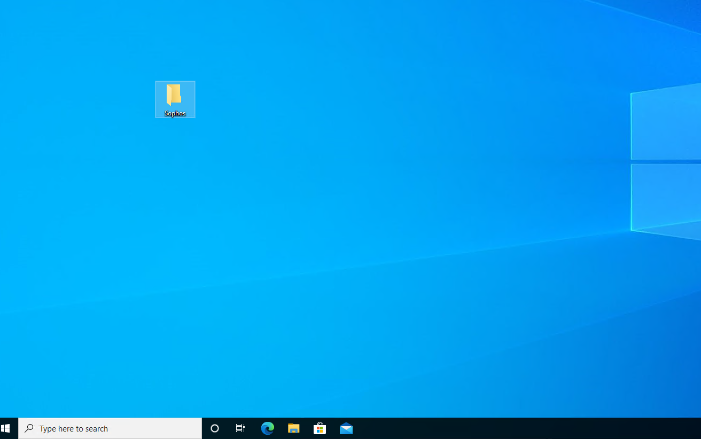

Inside this directory, create two additional directories: ***input*** and ***output***.

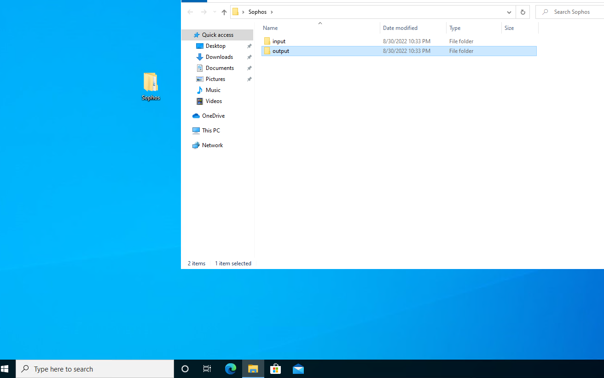

Inside the ***input*** directory, create a new file called ***install-sophos.cmd***, and another file called ***uninstall-sophos.cmd***.


Open ***install-sophos.cmd*** with notepad or any text editor, and copy the following contents into the file:

```sh
@ECHO OFF
SET SOURCE=%~dp0
SET SOURCE=%SOURCE:~0,-1%

:: Default install command
SophosSetup.exe --quiet 
```

The contents of the file should look like this:

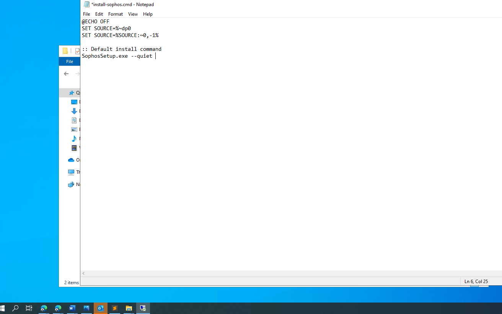

Save the file and close the text editor.

Finally, create another file called ***detection_script.ps1*** in the ***Sophos*** directory with the following contents in the file:

```sh
f (Test-Path "$env:programfiles(x86)\Sophos"){
    Write-Host "Found it!"
}
```
### Download Sophos Endpoint Installer<a name="download_endpoint"></a>
Log in to Sophos Central, and navigate to ***Protect Devices***.

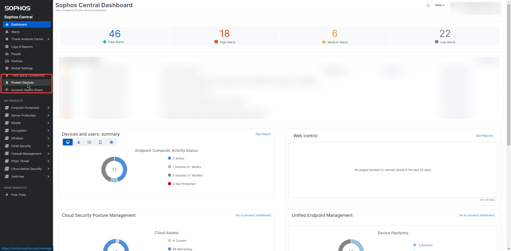

Download the ***Complete Windows Installer***. Once the file has been downloaded (the filename will be ***SophosSetup.exe***), move this file to the ***input*** folder that we previously created.

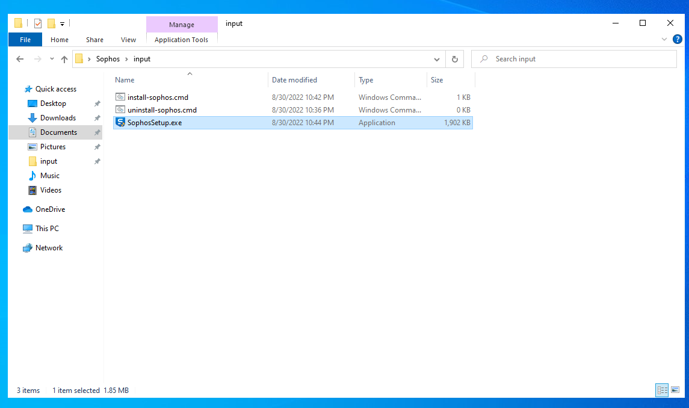


### Download Microsoft Win32 Content Prep Tool<a name="download_win32_app_util"></a>

Download the Win32 Content Prep Tool from Microsoft's GitHub repository here:
[Win32 Content Prep Tool](https://github.com/microsoft/Microsoft-Win32-Content-Prep-Tool/releases)

Download the file from the ***Source code (zip)*** link of the latest release:

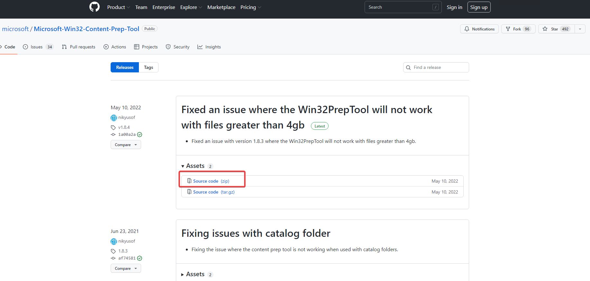

Expand the .zip file, and copy the executable into the ***Sophos*** directory on your Desktop. The directory tree should look like this:

```sh
└───Sophos
    │   IntuneWinAppUtil.exe
    │
    ├───input
    │       install-sophos.cmd
    │       SophosSetup.exe
    │       uninstall-sophos.cmd
    │
    └───output 
```

### Create intunewin file

Open Powershell or Command Prompt, and navigate to the ***Sophos*** directory on your Desktop. The Win32 Content Prep Tool supports the following command line options:

```sh
Version 1.8.4.0
Sample commands to use the Microsoft Intune App Wrapping Tool for Windows Classic Application:

IntuneWinAppUtil -v
  This will show the tool version.
IntuneWinAppUtil -h
  This will show usage information for the tool.
IntuneWinAppUtil -c <source_folder> -s <source_setup_file> -o <output_folder> <-a> <catalog_folder> <-q>
  This will generate the .intunewin file from the specified source folder and setup file.
  For MSI setup file, this tool will retrieve required information for Intune.
  If -a is specified, all catalog files in that folder will be bundled into the .intunewin file.
  If -q is specified, it will be in quiet mode. If the output file already exists, it will be overwritten.
  Also if the output folder does not exist, it will be created automatically.
IntuneWinAppUtil
  If no parameter is specified, this tool will guide you to input the required parameters step by step.
```

We will need to run the tool specifying the full path to our:

* source folder (***input*** directory)
* setup file (***SophosSetup.exe***)
* output folder (***output*** directory)

The command should look like this:

```sh
.\IntuneWinAppUtil.exe -c .\input\ -s .\input\SophosSetup.exe -o .\output\
```

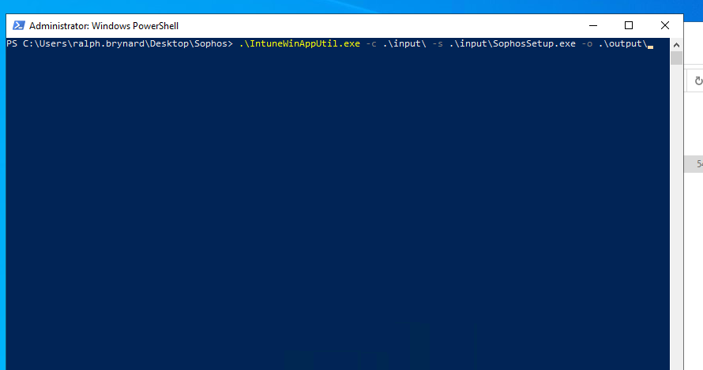

Once the command runs, output will display in your Powershell window:

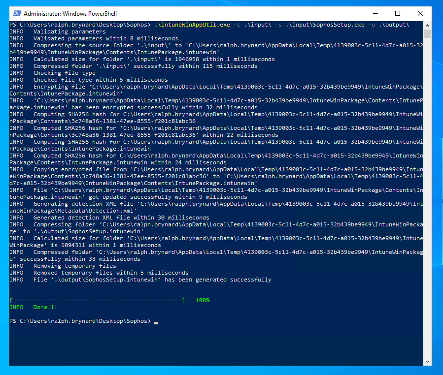

You will also have an artifact in the ***output*** directory with a file named ***SophosSetup.intunewin***

### Create Application in Endpoint Manager<a name="endpoint_manager"></a>

* Log-in to the [Endpoint Manager Console](https://endpoint.microsoft.com/#home), and navigate to ***Apps > All apps > add***.
* In the ***App type*** drop-down, select Windows app (Win32) as the App type.

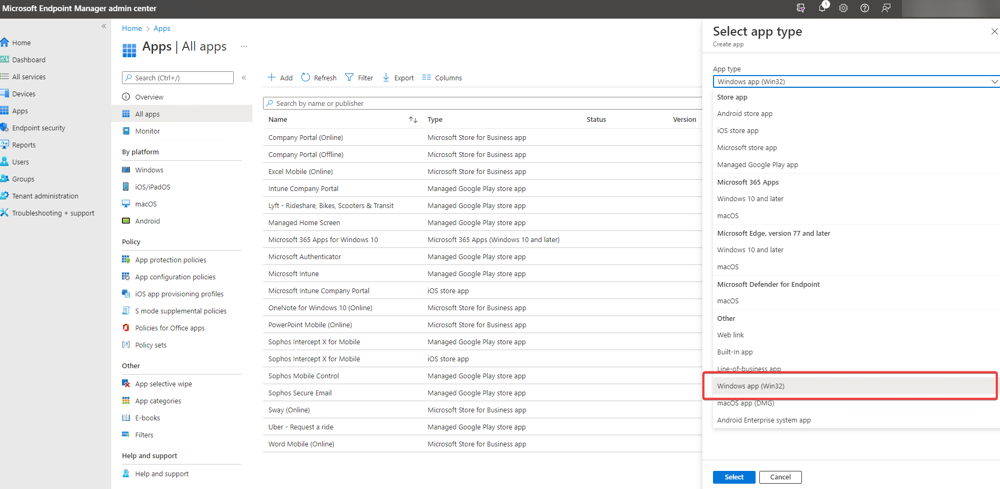

* Select the .intunewin file created previously as the app. package

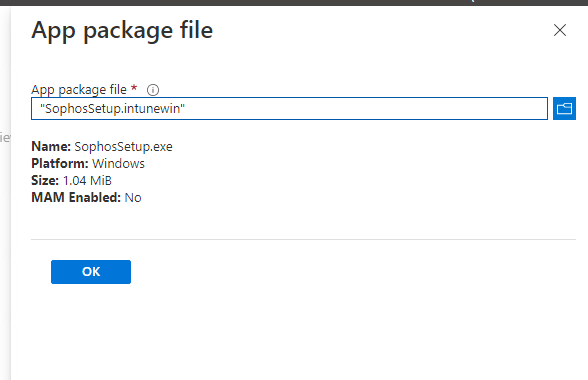

* In the app information tab, specify Sophos as the publisher as ***Publisher*** is a required field.

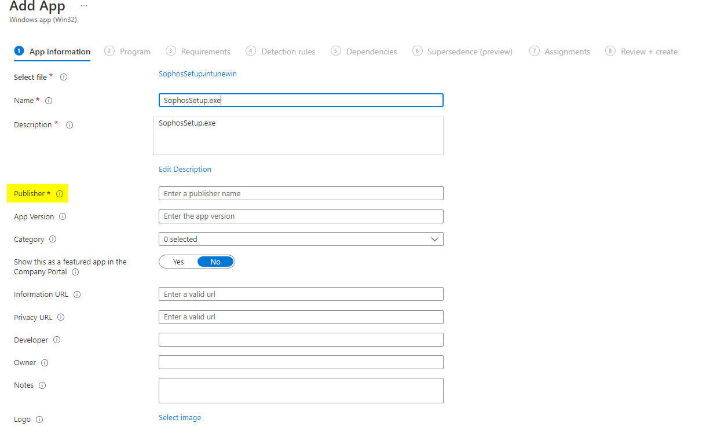

* Click ***Next***, and then specify the following values for the install command and uninstall command:

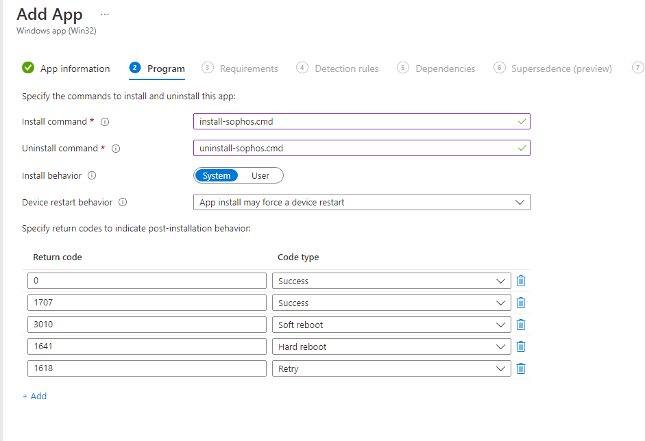

Leave all of the other fields as default, and click ***Next***

* In the ***Requirements*** tab, Select both 32-bit and 64-bit Operating System Architectures and specify your Minimum Operating System version.

* In the detection rules, change the ***Rules format*** to use a custom script. Select the ***detection_script.ps1*** file we created earlier. Leave the remaining settings as default, and click ***Next***

* Click ***Next*** again on the ***Supersedence*** tab.

* Assign the app. as needed in the ***Assignments*** tab, and click ***Next***

* On the ***Review and Create*** tab, click ***Create***


### [Demo](demo_url)

## Usage


```sh
usage
```

## Author

👤 **Ralph Brynard**

* Github: [@Dev0psPleb](https://github.com/Dev0psPleb)

## 🤝 Contributing

Contributions, issues and feature requests are welcome!

Feel free to check [issues page](issues_page). You can also take a look at the [contributing guide](contrib_guide).

## Show your support

Give a ⭐️ if this project helped you!


## 📝 License

Copyright © 2022 [Ralph Brynard](https://github.com/Dev0psPleb).

This project is [MIT](LICENSE) licensed.

***
_This README was generated with ❤️ by [readme-md-generator](https://github.com/kefranabg/readme-md-generator)_
